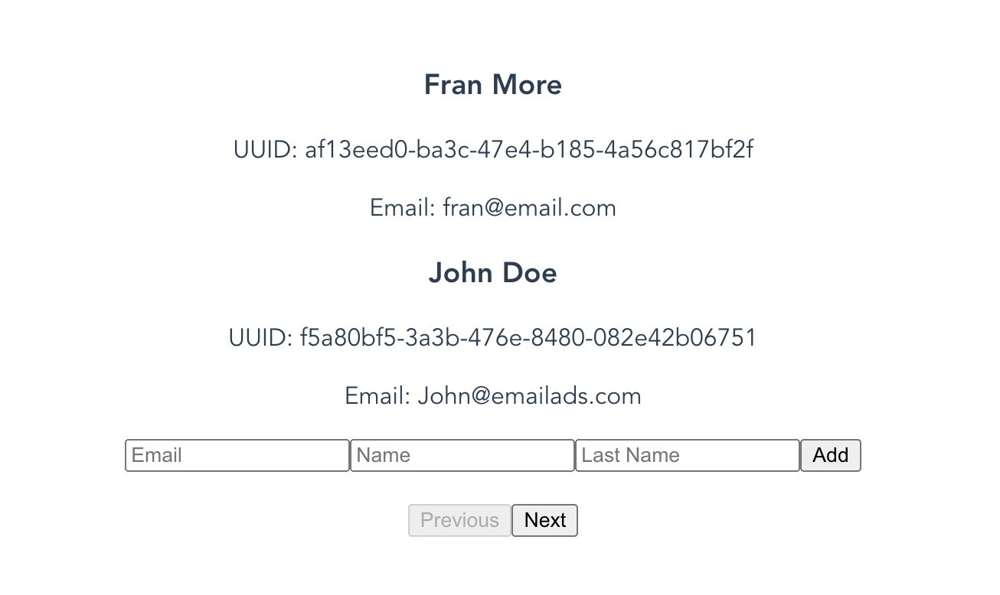

# Users API

This project showcases a simple Users API.

## Steps to set it up

1) Copy `.env.example` to `.env`
2) Copy `code/api/.env.example` to `code/api/.env`
3) Run:
    ```
    docker-compose up
    ```
4) Run:
    ```
    docker-compose exec php php consumer.php
    ```

### Tests

 ```
docker-compose exec php vendor/bin/phpunit tests --color
 ```

#### Coverage

 ```
docker-compose exec php vendor/bin/phpunit tests --color --coverage-html coverage
 ```

Coverage report will be created in [code/api/coverage/index.html](code/api/coverage/index.html)

## Available API endpoints

* [POST] [http://localhost/users](http://localhost/users)
  ```json
   {
      "uuid": "241414b4-8859-4e86-957e-11f76399ff11",
      "email": "john_doe@example.com",
      "name": "John",
      "lastName": "Doe"
   }
  ```
* [GET] [http://localhost/users?page=1&numResults=10](http://localhost/users?page=1&numResults=10)
   ```json
   {
       "total": 3,
       "page": 1,
       "pages": 1,
       "results": [
           {
               "uuid": "af13eed0-ba3c-47e4-b185-4a56c817bf2f",
               "email": "fran@email.com",
               "name": "Fran",
               "lastName": "More",
               "status": 1
           },
           {
               "uuid": "f5a80bf5-3a3b-476e-8480-082e42b06751",
               "email": "John@doe.com",
               "name": "John",
               "lastName": "Doe",
               "status": 1
           },
           {
               "uuid": "1bfb2e97-92b1-4035-af28-7922e949f4bd",
               "email": "Jane@doe.com",
               "name": "Jane",
               "lastName": "Doe",
               "status": 1
           }
       ]
   }
   ```
* [GET] [http://localhost/users/{uuid}](http://localhost/users/{uuid})
   ```
   {
       "uuid": "af13eed0-ba3c-47e4-b185-4a56c817bf2f",
       "email": "fran@email.com",
       "name": "Fran",
       "lastName": "More",
       "status": 1
   }
   ```

## Frontend

There's included a simple frontend build with Vue 3. You can go to [http://localhost:8080](http://localhost:8080) to start playing with it.

It renders the list of users (2 at a time), with pagination and a form to add more users.




## Architecture

The project has a DDD/Hexagonal architecture approach. That way the code is as agnostic as possible, more reusable and we could switch frameworks easily (**even though in this project no framework has been used**)

There is a [src](src) folder where all the _business_ code lies.

* [Application](code/api/src/Application): here we have the entry point services to our application. [Controllers](code/api/src/Infrastructure/Controller/UserController.php) are only allowed to connect with Application services.
* [Domain](code/api/src/Domain): folder where we store all our domain entities and logic, in the form of services.
* [Infrastructure](code/api/src/Infrastructure): this is the place to store all the code that will interact to external resources, databases, queues, cache, etc.

The entry point is an [index.php](code/api/index.php) file. Where all dependencies are declared and some logic to handle requests is added.

There's also a [consumer.php](code/api/consumer.php) file to handle events in the queue.

### About the [Post] http://localhost/users endpoint

This endpoint has been designed to be completely asynchronous. Whenever you call it (with user json data in the body) to create a user, it generates a [CreateUserEvent](code/api/src/Domain/Event/CreateUserEvent.php) that is dispatched to a RabbitMQ queue.

Via our [consumer](code/api/consumer.php), the event is handled and the user is created in [CreateUserEventHandler](code/api/src/Domain/Event/CreateUserEventHandler.php).

One important consideration is that the client must provide a UUID. This way we ensure that the endpoint is idempotent. It could be called a million times a minute with the same request for the same user and it will only be created once.

Making it async also helps us scaling the endpoint. We could run multiple instances of the consumer in case of high loads.

There's still room for improvement here. We could store a list of subscribers in a cache and check if the users exists before even dispatching the event. Or we could use a projection with the same objective.

## Areas for potential improvement

* Better Error Handling
* Add validations
* Add supervisor or similar for the queue consumer
* More tests
* Implement cache layer. In the hypothetical case that `[GET] /users` and `[GET] /users/{uuid}` are called millions of times per second, adding a cache layer would help scale the project. 

